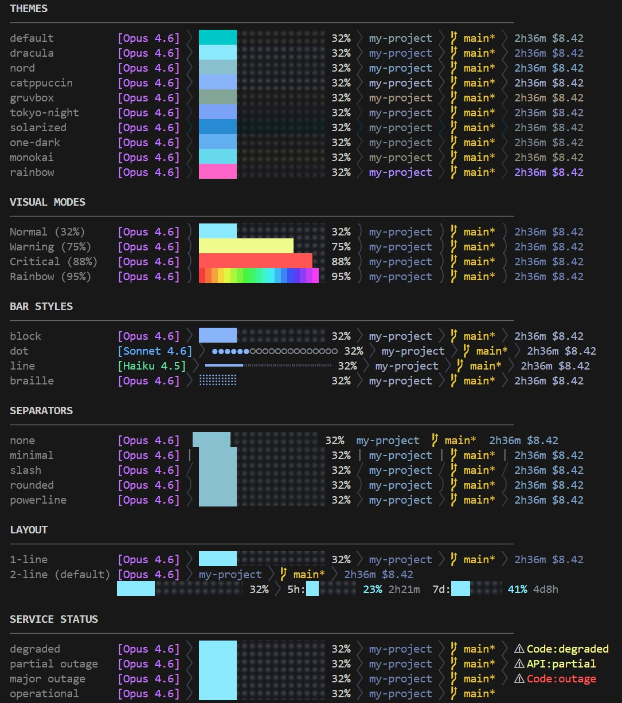

# claude-statusline

Zero-dependency statusline for [Claude Code](https://code.claude.com/) with conditional rainbow progress bar, 10 themes, rate limit monitoring, and natural language configuration.

[繁體中文](./README.zh-TW.md)



## Features

- **Rate Limit Monitoring** — 5-hour and 7-day quota usage with mini progress bars and reset countdown (native stdin on Claude Code 2.1.80+, OAuth fallback for older versions)
- **Conditional Rainbow** — Progress bar automatically shifts to rainbow gradient at high context usage
- **10 Themes** — default, rainbow, nord, catppuccin, dracula, gruvbox, tokyo-night, solarized, one-dark, monokai
- **12 Segments** — model, context bar, session (duration + cost), git, project, worktree, rate limit, promotion, status, PR review state, agent, effort
- **4 Bar Styles** — block `████░░░░`, dot `●●●●○○○○`, line `━━━━┅┅┅┅`, braille `⣿⣿⣿⣿⠀⠀⠀⠀`
- **5 Separators** — powerline, rounded, slash, minimal, none
- **18 Custom Colors** — Override any color with hex values
- **Responsive Layout** — Auto-hide low-priority segments when terminal is narrow
- **Natural Language Config** — Configure via `/claude-statusline:customize dracula + dot + powerline`
- **Promotion Segment** — Temporary: shows 1x/2x context multiplier and peak/off-peak countdown during active promotions

## Prerequisites

- [Claude Code](https://code.claude.com/) v1.0.33+
- [Node.js](https://nodejs.org/) v18+

## Installation

### Claude Code Plugin (Recommended)

```bash
# 1. Via the bouob-plugins marketplace (recommended)
/plugin marketplace add bouob/claude-plugins
/plugin install claude-statusline@bouob-plugins

#    Or directly from this repo
/plugin marketplace add bouob/claude-statusline
/plugin install claude-statusline@claude-statusline

# 2. Reload plugins
/reload-plugins

# 3. Run setup (writes to ~/.claude/settings.json automatically)
/claude-statusline:setup

# 4. Restart Claude Code
```

### Manual Installation

```bash
git clone https://github.com/bouob/claude-statusline.git
cd claude-statusline
npm install && npm run build
node scripts/setup.js
# Restart Claude Code
```

## Visual Modes

The progress bar automatically changes based on context usage:

| Condition | Mode | Effect |
|-----------|------|--------|
| Context < 70% | `normal` | Subtle theme colors |
| Context 70–85% | `warning` | Yellow tones |
| Context 85–90% | `critical` | Red tones |
| Context > 90% | `rainbow` | Per-character rainbow gradient |

## Themes

| Theme | Style |
|-------|-------|
| `default` | Subtle cyan |
| `rainbow` | Pink-purple tones |
| `nord` | Nordic cool blues |
| `catppuccin` | Mocha warm tones |
| `dracula` | Deep purple-blue |
| `gruvbox` | Retro warm tones |
| `tokyo-night` | Tokyo night blue-purple |
| `solarized` | Classic Solarized Dark |
| `one-dark` | Atom One Dark |
| `monokai` | Sublime Monokai |

## Available Commands

| Command | Usage |
|---------|-------|
| `/claude-statusline:setup` | Register statusline in `~/.claude/settings.json` |
| `/claude-statusline:customize` | Interactive wizard or quick edit (e.g. `dracula + dot + powerline`) |
| `/claude-statusline:customize show` | View current configuration |

## Configuration

### Plugin Skill (Recommended)

Use natural language to configure — no manual JSON editing needed:

```
/claude-statusline:customize dracula + dot + powerline
/claude-statusline:customize show current
/claude-statusline:customize reset
```

Run without arguments for an interactive wizard:

```
/claude-statusline:customize
```

### Config File

Config files are loaded in priority order:

1. `./.claude-statusline.json` — Project-level (highest priority, resolved against the session's `project_dir`)
2. `~/.claude/claude-statusline.json` — User-level

```json
{
  "theme": "dracula",
  "separator": "powerline",
  "barStyle": "dot",
  "responsive": true,
  "colors": {
    "opus": "#FF79C6"
  },
  "segments": {
    "rate-limit": {
      "enabled": true,
      "showFiveHour": true,
      "showSevenDay": true,
      "showResetTime": true
    }
  },
  "rainbow": {
    "contextThreshold": 90,
    "alwaysOn": false
  }
}
```

Only include the fields you want to override — everything else uses theme defaults.

<details>
<summary>Full config reference</summary>

```json
{
  "theme": "default",
  "colorMode": "auto",
  "separator": "none",
  "barStyle": "block",
  "responsive": true,
  "colors": {},
  "layout": {
    "lines": 2,
    "line1": ["model", "effort", "agent", "project", "git", "pr", "worktree", "promotion"],
    "line2": ["context-bar", "session", "rate-limit", "status"]
  },
  "segments": {
    "context-bar": { "enabled": true, "width": 20, "showPercentage": true },
    "session": { "enabled": true, "showCost": true, "showDuration": true, "showLines": false },
    "git": { "enabled": true },
    "project": { "enabled": true },
    "model": { "enabled": true },
    "worktree": { "enabled": true },
    "pr": { "enabled": true },
    "agent": { "enabled": true },
    "effort": { "enabled": true, "showThinking": true },
    "rate-limit": {
      "enabled": true,
      "cacheSeconds": 60,
      "barWidth": 8,
      "barStyle": "inherit",
      "showFiveHour": true,
      "showSevenDay": true,
      "showResetTime": true,
      "showBar": true,
      "rainbow": false
    },
    "promotion": { "enabled": true },
    "status": { "enabled": true, "cacheTtlSeconds": 300 }
  },
  "rainbow": {
    "contextThreshold": 90,
    "onAgent": false,
    "onWorktree": false,
    "alwaysOn": false
  }
}
```

</details>

### Refresh Interval

> Requires Claude Code **v2.1.97+**

By default, Claude Code only invokes the statusline command after each turn completes. Dynamic segments (context bar, rate limit, session duration) therefore stay frozen during long-running turns. To make the statusline update on a timer, add `refreshInterval` to `~/.claude/settings.json`:

```json
{
  "statusLine": {
    "type": "command",
    "command": "node /path/to/claude-statusline/dist/index.js",
    "refreshInterval": 30
  }
}
```

`refreshInterval` is measured in seconds. Recommended value: `30` — balances responsiveness against startup overhead (~50–100 ms per tick).

Note: `refreshInterval` is a **Claude Code core setting**, not a plugin config — it lives in `settings.json`, not `claude-statusline.json`. The setup script writes `refreshInterval: 30` on fresh installs and preserves any value you have set when re-registering the statusline.

### Custom Colors

Override any of the 18 color keys with hex values (`#RGB` or `#RRGGBB`):

`opus`, `sonnet`, `haiku`, `fable`, `mythos`, `progressNormal`, `progressWarning`, `progressCritical`, `progressEmpty`, `gitClean`, `gitDirty`, `worktree`, `project`, `session`, `resetTime`, `pr`, `agent`, `effort`

```json
{
  "colors": {
    "opus": "#FF6B6B",
    "progressNormal": "#50FA7B"
  }
}
```

Priority: `colors` field > theme definition > defaults.

## Segments

| Segment | Content |
|---------|---------|
| `model` | Model name with color (Opus purple / Sonnet blue / Haiku green) |
| `context-bar` | Progress bar + percentage (rainbow gradient at high usage) |
| `session` | Duration + cost (+ lines changed with `showLines`) |
| `git` | Branch name + dirty status (runs in the session's `current_dir`) |
| `project` | Project folder name |
| `worktree` | Worktree label (`git_worktree` / top-level `worktree` field, path-divergence fallback) |
| `rate-limit` | 5h/7d quota usage + mini progress bar + reset countdown (native stdin, OAuth fallback) |
| `promotion` | Time-limited promotion label (auto-hidden when inactive) |
| `status` | Claude service status indicator (cached) |
| `pr` | PR number + review state (approved ✓ / changes requested ✗ / pending ○ / draft ◌) |
| `agent` | Agent name during `--agent` sessions |
| `effort` | Reasoning effort level, with ✦ marker when extended thinking is on |

> `pr`, `agent`, and `effort` need a recent Claude Code (approx v2.1.200+). On older versions those stdin fields are absent and the segments hide automatically.
>
> The `git` segment reflects each session's own `current_dir`, so concurrent sessions in different directories or worktrees show their own branch. Two sessions sharing one directory still share one HEAD — use worktrees for per-session branches.

## Uninstall

Remove the `statusLine` field from `~/.claude/settings.json`, then restart Claude Code.

## License

MIT
